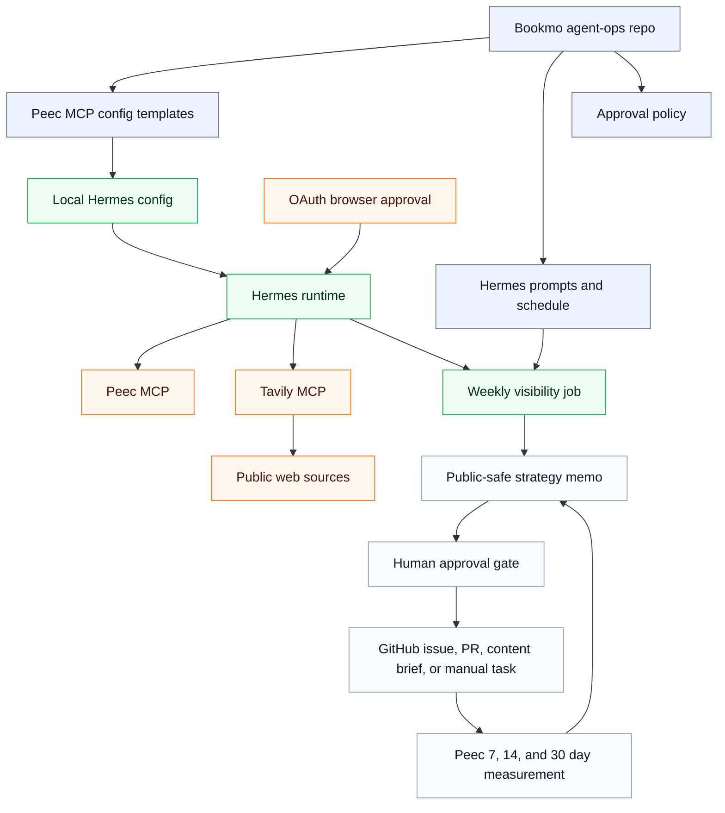

# Architecture

Hermes is the runtime for Bookmo's Peec Visibility Operator. This repo owns the
public-safe prompts, schedules, MCP templates, approval policy, and durable
strategy output that guide the operator.

The setup flow is also exported as an SVG for docs surfaces that do not render
Mermaid directly: [`docs/assets/peec-visibility-setup.svg`](assets/peec-visibility-setup.svg).

## Runtime Components

- Hermes Agent installed on a local machine or VPS.
- Peec MCP remote HTTP server at `https://api.peec.ai/mcp`.
- Tavily MCP remote HTTP server at `https://mcp.tavily.com/mcp/` for public
  web search and source extraction.
- Optional GitHub MCP or local `gh` CLI.
- Repo-local strategy output under `docs/peec/actions/`.

## Research Boundary

Peec remains the source of truth for visibility actions, opportunity ranking,
and measurement. Tavily is supporting research infrastructure: use it to verify
that recommended public targets exist, extract public page content for review,
find current source citations, and check whether competitor or category claims
are already supported by public evidence.

## State

Durable state lives in Git:

- prompts
- policies
- project tracker
- weekly reports
- schemas

Hermes memory is useful but not authoritative.
