# Runbook

## Setup Flow



The Mermaid source for this SVG lives at
`docs/assets/peec-visibility-setup.mmd`. The same diagram is embedded in
`docs/architecture.md` for renderers that support Mermaid directly.

## Install Hermes

```bash
curl -fsSL https://raw.githubusercontent.com/NousResearch/hermes-agent/main/scripts/install.sh | bash
hermes setup
hermes model
hermes doctor
```

## Configure Peec MCP

Merge `hermes/config/mcp/peec.yaml` into `~/.hermes/config.yaml`.
The Peec endpoint is path-scoped at `https://api.peec.ai/mcp`; keep the
`oauth.preserve_server_url: true` setting from the template so OAuth resource
validation uses the full `/mcp` URL instead of only `https://api.peec.ai`.

Peec uses OAuth for MCP. Do not put Peec credentials in this repo or in
`~/.hermes/.env`; Hermes stores MCP OAuth tokens under its runtime home.

### Azure / Headless Host OAuth

If Hermes runs on an Azure VM, do the first OAuth authorization from an SSH
session on that VM:

```bash
ssh -L 33418:127.0.0.1:33418 <azure-user>@<azure-host>
hermes mcp add peec-ai --url https://api.peec.ai/mcp --auth oauth
```

When Hermes prints the authorization URL, open it in your local browser. The
SSH tunnel forwards the local OAuth callback to the VM. If Hermes reports a
different localhost callback port, reconnect SSH with that port forwarded
instead.

Then start Hermes and verify:

```text
Tell me which MCP-backed tools are available.
List my Peec AI projects.
```

If config changes while Hermes is running:

```text
/reload-mcp
```

## Create Weekly Job

Use the command in `hermes/config/schedules/weekly-peec-visibility.md`.

Test immediately:

```text
/cron run <job_id>
```

## Expected Output

The weekly job writes:

```text
docs/peec/actions/YYYY-MM-DD.md
```

The memo should end with approval questions before issue creation, PR drafting,
outreach, publishing, or public posting.
